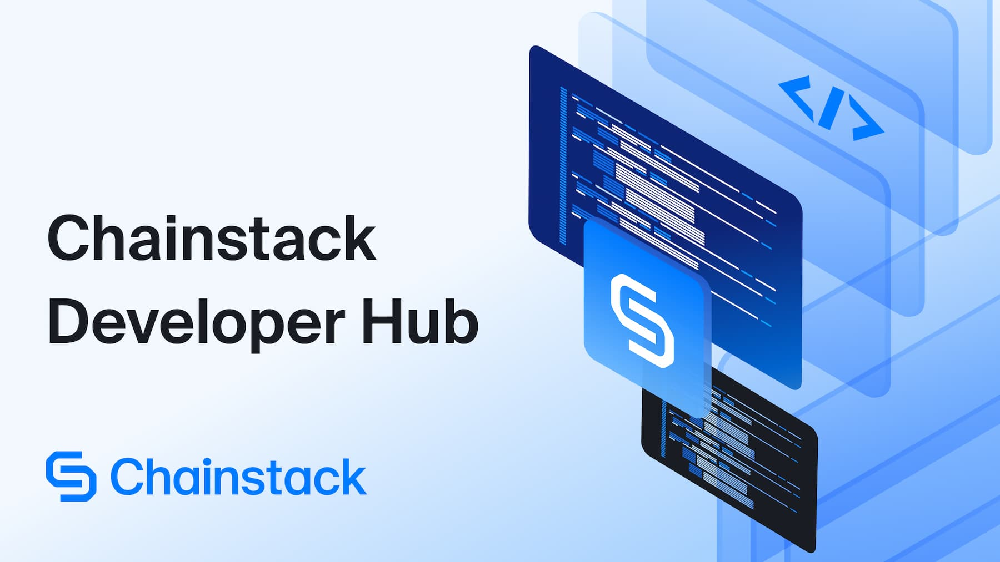

# Chainstack Developer Hub

The Chainstack Developer Hub is an initiative that encourages developers to submit articles and tutorials which will be published in the [Chainstack blog](https://chainstack.com/blog/), and **get paid for it**.

You can [find more details in the press release]().

## Contribute guidelines

If you have an idea for an article, tutorial, or an interesting piece of content that you want to publish in the Chainstack Developer Hub, you can do it by following these steps:

### 0. Join our online communities

We recommend all Chainstack Developer Hub members to join our Discord and Telegram channels to have direct contact with the team.

- [Join our Discord](https://discord.gg/Cymtg2f7pX)
- [Join our Telegram](https://t.me/chainstack)

If you don't want to miss any of the content published, you can also [follow us on Twitter](https://twitter.com/ChainstackHQ) 🤙

### 1. Create a proposal

**Please review our [content requirements below](#content-requirements) before submitting a proposal.**

Once you've reviewed the requirements, 👉👉[create a proposal here](https://github.com/chainstack/developer-hub-content/issues/new?assignees=&labels=&template=proposal.md&title=%5BPROPOSAL%5D) 👈👈

Make sure you add a title, check the correspondent category (coding, informational, other), and add a brief description of what the article is about. **Do not include more details like code snippets.**

Someone from the Chainstack team will review your proposal and comment on it. Once it's approved, you can move on to the next step 👇

### 2. Write and submit the content

Before starting working on the first draft of your article, **check the [article guidelines below](#article-guidelines)**.

To submit the content, fork this repo and **submit a PR with the following changes:**

- All your content will be created in a subfolder inside the corresponding category (`coding-articles`, `info-articles` or `other-articles`). Follow the kebab-case naming convention (eg "my-awesome-article").
- The code will be created inside a `code` subfolder. There must be a `README.md` file with instructions to install dependencies, run the code, etc.
- All images will stored inside an `images` subfolder.
- Create an `Article.md` file with the article itself.
- Create an `About.md` file with information about you and some websites and social media profiles that you'd like us to include.

Example:

```
/coding-articles/my-awesome-tutorial
                            /About.md
                            /Article.md
                            /images/
                            /code/
                            /code/Readme.md
```

### 3. Review process

Your article will be reviewed by the Chainstack team and comments will be added in the GitHub Pull Request so keep an eye on it 😉

### 4. Publication

Once the article is ready to be published, we'll schedule it and let you know the publication date.

### 5. Get rewarded

Once your article is published in the blog, you'll get rewarded for it. 💰

### 6. Provide support

Once your article is published, some members of the community might need assistance or find issues. You'll be asked to provide support on those cases.

## Content requirements

### General requirements

- Your submission **must be an original and NOT a work that was previously published.**
- You **must be the rightful intellectual property owner (author) of your submission.**
- Your work **can contain relevant external sources, only when referenced accordingly.**
- Your work **must contain relevant, original, and working code segments that can be replicated.**
- All editorial changes **must be completed within a 14 day window upon receiving word about them.**
- Content **must be provided following the guidelines in this GitHub repository.**
- By submitting the piece, you **agree to give Chainstack rights to distribute your content.**

### Subject requirements

- Your submission must take a neutral stance and **refrain from promoting other projects**.
- Your submission must cover one or more of [Chainstack’s supported protocols](https://chainstack.com/protocols/).
- Your submission must cover one or more of the following Web3 topics:
  - Protocols
  - Full or archive
  - Clients
  - HTTP/WSS
  - Methods
    - EVMs
    - Solana
    - Debug & Trace
    - Erigon_
  - Indexing
  - Storage
  - Mempool access and Warp transactions
  - White listing
  - Locations
  - Load balancing
  - Dedicated gateway
  - MEV

If you're not sure if your topic fits the criteria above, just [create a proposal](https://github.com/chainstack/developer-hub-content/issues/new?assignees=&labels=&template=proposal.md&title=%5BPROPOSAL%5D) and we'll review it with you 😉

## Article guidelines

Here we'll detail some guidelines that you should follow when working on your article:

- **Title**: be as descriptive as possible and try to make it catchy 😉
- **Images**: upload all images that support the article to the repository. Keep an eye on the image size and use tools like [TinyPNG](https://tinypng.com) or [Squoosh](https://squoosh.app/) to compress them.
- **Banner/open graph image** (optional): you can create a banner and open graph image for the article but try to follow Chainstack's style guide. If not provided, we'll create one 😉
- **Structure**: we recommend following this structure
  - Intro and goals
  - Pre-requisites (if any)
  - Step-by-step (with working code segments)
  - Conclusion (with link to code repo)

## Frequently asked questions

**Can I cross-post articles from my own blog?**

No. All content must be original and not previously published.

**Do I get paid if one of my articles/tutorials is published?**

No. You get a byline however.

**Can I promote my personal project on the article?**

You can promote your projects in your bio, which will be published with the article.

If you have any other questions, you can contact us [on our Discord channel](https://discord.gg/Cymtg2f7pX).

**Can I publish articles under a pseudonym?**

Yes.

## Additional information

This document is in progress and content requirements might change. Please reach out to the Chainstack team if you have any questions.
