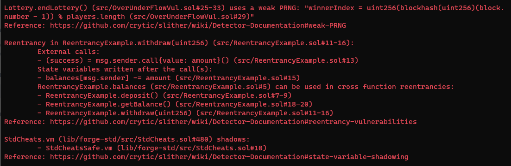

# Introduction to Smart Contract Auditing

## Introduction

Smart contract auditing is the process of reviewing and evaluating the code of a smart contract to identify potential security vulnerabilities, bugs, and other issues that may impact the contract's functionality. There are two main types of auditing: manual auditing and automated auditing. Manual auditing involves reviewing the code line-by-line and using tools like Slither to identify potential issues. Automated auditing involves using software tools to scan the code and identify potential vulnerabilities. The need to audit smart contracts is critical, as smart contracts are immutable and can cause significant harm if they contain security vulnerabilities. In this project, we will provide an overview of smart contract auditing, with a focus on manual auditing techniques. We will also cover common attack vectors, such as reentrancy, replay attacks, and overflows, and provide code examples and snippets to demonstrate how to use tools like Slither in auditing contracts, as well as how to test and report on identified issues.

## What is Smart Contract Auditing?

Smart contract auditing is the procedure of extensively inspecting and examining a smart contract's code to find any security flaws, defects, and other issues that might impair the contract's operation. The purpose of smart contract auditing is to guarantee that the contract works as it should and that the code is safe from malicious attacks and unforeseen outcomes.

Smart contracts are self-executing contracts that are recorded on a blockchain network and operate automatically without the use of intermediaries. They're used to automate operations and make transactions more transparent and safe. Because smart contracts are immutable, they cannot be changed once they are put on the blockchain. This implies that any problems or vulnerabilities in the code will remain, thus a thorough examination and assessment of the code is required before deployment.

## Types of Auditing

Smart contract auditing can be performed manually or through the use of automated tools.

### Manual Auditing

Manual smart contract auditing is a type of assessment method in which the code of a smart contract is manually reviewed to discover any security vulnerabilities, bugs, as well as other issues that may affect its functioning. Manual smart contract auditing aims to give a thorough, human-led evaluation of the contract's code in order to identify security issues and provide recommendations for mitigating those risks.

Manual smart contract auditing involves reviewing the code structure, logic, and comments to understand the contract's purpose, testing the code for security vulnerabilities, using tools like **Slither** to automate some aspects of the process, and documenting the findings of the audit.

### Automated Auditing

The method of automated smart contract auditing involves utilizing software tools to assess the security of smart contracts. The goal of automated auditing is to identify security risks in the smart contract code, including vulnerabilities, flaws, and other problems. Automated auditing employs algorithms and scripts to scan the code and find possible security issues, as opposed to manual auditing, which involves a human reviewing the code line-by-line.

Automated auditing has the benefit of being quicker. It can quickly scan the whole codebase and find a huge number of possible flaws. This is particularly helpful for sophisticated, large-scale smart contract systems.

Automated auditing has the benefit of being quicker and more thorough than manual auditing since it can quickly scan the whole codebase and find a huge number of possible flaws. This is particularly helpful for sophisticated, large-scale smart contract systems.

Automated auditing tools work by examining the code and searching for known-to-be-vulnerable patterns and code snippets. For instance, the tool may look for instances of code that could result in an overflow or underflow or check for the use of certain functions or libraries that have been identified as vulnerable.

A report that shows the problems and offers recommendations on how to fix them will be generated once the automated auditing program has identified possible vulnerabilities.

In this article, our focus will be on manual smart contract auditing.

## Why the Need to Audit Smart Contracts?

The need to audit smart contracts is critical, as smart contracts are self-executing and immutable once deployed on the blockchain. This means that once a smart contract is deployed, its code and behaviour cannot be changed, making it important to identify and resolve any security vulnerabilities before deployment.

Smart contracts are often used to manage and transfer valuable assets, such as cryptocurrencies, on the blockchain. If a smart contract contains security vulnerabilities, it can be exploited by malicious actors, leading to the loss of these assets. For example, a smart contract that has a vulnerability that allows someone to steal funds from the contract can result in a significant financial loss for the contract's users.

Additionally, smart contracts are designed to be autonomous and self-executing, meaning they can perform actions automatically without the need for human intervention. This is both a strength and a weakness of smart contracts, as a vulnerability in the code can cause the contract to behave in unintended ways, such as sending funds to the wrong address, or executing code in an infinite loop.

In short, auditing smart contracts is important because it helps identify and resolve potential security vulnerabilities and bugs, ensuring that the contract behaves as intended and provides the necessary security for users and their assets.

## Auditing Smart Contracts Manually with Slither and Foundry.

### What is Slither?

Slither is a tool for making smart contracts more secure. It was created by ***Trail Of Bits*** and was first released to the public in 2018. Slither is a type of software that helps check the security of smart contracts. It's written in a programming language called Python 3 and looks for potential problems in the code of a smart contract.

Slither has different types of checks built into it, to help find different kinds of security issues. It also provides information about the details of the smart contract and has an API that makes it easy to add custom checks. This tool helps developers find and fix problems, understand the code better, and create custom checks as needed.

Slither works by analyzing the code of a smart contract and looking for specific patterns and code snippets that are known to be vulnerable. Once Slither has identified potential vulnerabilities in the code, it generates a report that highlights the issues and provides recommendations for how to fix them.

### How to Install Slither

Slither requires [solc](https://docs.soliditylang.org/en/latest/installing-solidity.html), the Solidity compiler, and [Python 3.8+](https://www.python.org/downloads/).

* **Using Pip**
    
    ```plaintext
    pip3 install slither-analyzer
    ```
    

To learn more about other installation methods, go to the [Slither repository](https://github.com/crytic/slither#how-to-install).

* Next, install the [slither extension](https://marketplace.visualstudio.com/items?itemName=trailofbits.slither-vscode) in vscode
    

Now that's for slither. Let's go over Foundry and how to install it.

### What is Foundry?

Foundry is a toolkit for building applications on the Ethereum blockchain. It's written in a programming language called Rust and is designed to be fast, flexible, and easy to use.

Foundry is made up of several different tools that work together to make building and testing Ethereum applications easier. Some of the tools include:

* Forge: A testing framework for Ethereum applications, similar to other testing frameworks like Truffle, Hardhat, and DappTools.
    
* Cast: A tool that helps you interact with smart contracts on the Ethereum blockchain. You can use it to send transactions and get information about the blockchain.
    
* Anvil: A local Ethereum node, similar to Ganache and Hardhat Network, that you can use to test your applications.
    
* Chisel: A Solidity REPL (Read-Eval-Print Loop) that lets you test and run Solidity code in a fast, efficient, and verbose way.
    

Each of these tools is designed to make different parts of the Ethereum development process easier and more efficient, and when used together, they provide a comprehensive toolkit for building and testing Ethereum applications.

### How to Install Foundry

To get started with Foundry, you need to install a tool called "foundryup." Here's how:

* Open your terminal and run this command(linux and mac):
    

```bash
curl -L https://foundry.paradigm.xyz | bash
```

* Once you've got the installation script, open a new terminal or make sure your PATH is up-to-date. Then, run the `foundryup` command.
    

That's it! You're now ready to start using Foundry. If you require additional information or assistance, please visit the Foundry [repository](https://github.com/foundry-rs/foundry#installation) or check out the [Foundry book](https://book.getfoundry.sh/getting-started/installation).

### Auditing Smart Contracts

Let's review the steps in the auditing process before we start. The process of auditing a smart contract typically includes the following steps:

1. Running tests - This step involves running various tests on the smart contract code to identify any potential issues.
    
2. Reading specifications and documentation - This step involves thoroughly reading the specifications and documentation for the smart contract to gain a deep understanding of how it works.
    
3. Running fast tools - Tools like Slither are used to quickly identify potential vulnerabilities and security issues in the code.
    
4. Manual analysis - After running the tests and using tools, a manual analysis of the code is performed to identify any issues that may have been missed by the automated processes.
    
5. Discussion - Any identified issues are discussed to ensure a thorough understanding of the problem and to determine the best course of action.
    
6. Writing the report - Finally, a comprehensive report is written that documents all the identified issues, including recommendations for fixing any problems. The report can be used as a reference for future updates or audits of the smart contract.
    

Okayyy! Let's jump into auditing a code base!

Remember, we'll be working on the project using Foundry and Slither. [Click here](https://github.com/natachigram/audit-practice.git) to access the project's github repository.

1. **First, open Vscode. Then, make a new folder and clone the** [**github repo**](https://github.com/natachigram/audit-practice.git) **for this task. After that, go to your terminal and type "forge install".**
    
    ```plaintext
    $ https://github.com/natachigram/audit-practice.git
    $ cd audit-practice
    $ forge install
    ```
    
    In the <mark>audit/src/ </mark> folder, there are three contracts written in Solidity. We will be using these contracts for this tutorial. Also, remember to look at the <mark>audit/test/</mark> folder, as we will discuss it later.
    
2. You can do static analysis with Slither in two ways. You can either use it in the terminal or as an [extension](https://marketplace.visualstudio.com/items?itemName=trailofbits.slither-vscode) in vscode. We'll explain both options so it's easy to understand.
    
    **On your terminal run** `slither .`
    
    ```plaintext
    slither .
    ```
    
    You'll see some results in three groups: high (green), medium (yellow), and low (green) vulnerabilities. You can achieve the same outcome by using the slither extension in vscode. **Just click on the slither icon and then run it.**
    

Slither found two high level risks:

The ReentrancyExample.sol contract has a <mark>reentrancy issue.</mark>

The OverUnderVul.sol contract uses a <mark>weak PRNG</mark>.

       

If you examine closely, you'll see that Slither missed a major problem in the OverUnderVul.sol contract and ReplayVul.sol. That's why it's important to also manually go through the code one line at a time.

1. **Manual Code Review:**
    
    we will going over the **OverUnderVul.sol which is a Lottery contract first.**
    
    ```solidity
    // SPDX-License-Identifier: MIT
    pragma solidity ^0.8.0;
    
    contract Lottery {
        address public owner;
        uint public jackpot;
        mapping(address => uint) public balances;
        address[] public players;
        bool public isEnded;
        
        constructor() {
            owner = msg.sender;
            jackpot = 0;
            isEnded = false;
        }
        
        function buyTicket() public payable {
            require(!isEnded, "Lottery has ended");
            require(msg.value == 1 ether, "Please send 1 ether to buy a ticket");
            players.push(msg.sender);
            balances[msg.sender] += msg.value;
            jackpot += msg.value;
        }
        
        function endLottery() public {
            require(msg.sender == owner, "Only owner can end the lottery");
            require(!isEnded, "Lottery has already ended");
            isEnded = true;
            uint winnerIndex = uint(blockhash(block.number - 1)) % players.length;
            address winner = players[winnerIndex];
            balances[winner] += jackpot;
            jackpot = 0;
        }
    }
    ```
    
    After thoroughly reviewing the contract, it has been discovered that there are potential vulnerabilities with both overflow and underflow.
    
    Firstly, an overflow vulnerability exists in the jackpot variable. If the sum of all ticket purchases exceeds the maximum value that can be stored in a uint variable, which is 2^256-1, the jackpot variable will reset to zero. This can result in the winner receiving an incomplete prize and cause unexpected behavior in other areas of the contract.
    
    Secondly, an underflow vulnerability exists in the balances mapping. If a player withdraws more funds than they have in their balance, the balance will underflow and wrap around to the maximum value of a uint variable. This allows them to withdraw a large amount of funds that they do not own and could be exploited by malicious actors to steal funds from the contract.
    
    *To prevent these vulnerabilities, the contract could add additional checks to ensure that the jackpot and balances variables do not overflow or underflow. For example, the contract could limit the maximum value of the jackpot or use a different data type that supports larger numbers. The contract could also check that a player has sufficient funds before allowing them to withdraw any amount.*
    
    **Modifying and writing POC for the OverUnderVul.sol contract:**
    
    Here is a modified version of the Lottery contract in the OverUnderFlowVul.sol file; that includes checks to prevent overflow and underflow vulnerabilities:
    
    ```solidity
    // SPDX-License-Identifier: MIT
    pragma solidity 0.8.0;
    
    contract Lottery {
    address public owner;
    uint256 public jackpot;
    mapping(address => uint256) public balances;
    address[] public players;
    bool public isEnded;
    
    constructor() {
        owner = msg.sender;
        jackpot = 0;
        isEnded = false;
    }
    
    function buyTicket() public payable {
        require(!isEnded, "Lottery has ended");
        require(msg.value == 1 ether, "Please send 1 ether to buy a ticket");
        players.push(msg.sender);
        balances[msg.sender] += msg.value;
        require(jackpot + msg.value > jackpot, "Jackpot overflow");
        jackpot += msg.value;
    }
    
    function endLottery() public {
        require(msg.sender == owner, "Only owner can end the lottery");
        require(!isEnded, "Lottery has already ended");
        isEnded = true;
        uint256 winnerIndex = uint256(blockhash(block.number - 1)) % players.length;
        address winner = players[winnerIndex];
        require(jackpot > 0, "No jackpot to award");
        balances[winner] += jackpot;
        require(balances[winner] >= jackpot, "Balance underflow");
        jackpot = 0;
    }
    }
    ```
    

The following are the contract modifications:

* The jackpot variable is now a uint256 type to support larger numbers.
    
* A check for jackpot overflow has been added to the buyTicket function to ensure that the jackpot does not exceed the maximum value of a uint256 variable.
    
* A check for balance underflow has been added to the endLottery function to ensure that the winner's balance does not go below zero when adding the jackpot amount.
    

Here is a **POC** script that deploys and interacts with the modified contract:

```solidity
// SPDX-License-Identifier: MIT
pragma solidity ^0.8.0;

import "./OverUnderFlowVul.sol";

contract LotteryPOC {
    OverUnderFlowVul public lottery;

    constructor() {
        lottery = new OverUnderFlowVul();
    }

    function buyTickets(uint256 numTickets) public payable {
        for (uint256 i = 0; i < numTickets; i++) {
            lottery.buyTicket{value: 1 ether}();
        }
    }

    function endLottery() public {
        lottery.endLottery();
    }

    function withdraw() public {
        uint256 balance = lottery.balances(msg.sender);
        require(balance > 0, "No funds to withdraw");
        lottery.balances(msg.sender) = 0;
        payable(msg.sender).transfer(balance);
    }
}
```

The contract is a proof of concept that deploys an instance of the Lottery contract. The contract provides three methods to the user: buyTickets, endLottery, and withdraw. The buyTickets method allows the user to buy a specified number of tickets, and the endLottery method allows the owner of the Lottery contract to end the lottery and select a winner. Finally, the withdraw method allows players to withdraw their winnings.

These changes were made to prevent vulnerabilities related to overflow and underflow in the Lottery contract (OverUnderFlow.sol file) . By making these changes, the Lottery contract is now more secure and fair for all players.

**Now, let's go over ReplayVul.sol which is a SimpleNFTMarketplace contract.**

```solidity
// SPDX-License-Identifier: MIT

pragma solidity ^0.8.0;

contract SimpleNFTMarketplace {
    mapping(address => uint256) public balances;
    mapping(uint256 => address) public tokenOwners;

    function buyToken(uint256 _tokenId, uint256 _price) public {
        require(tokenOwners[_tokenId] != address(0), "Token does not exist");
        require(balances[msg.sender] >= _price, "Insufficient balance");
        balances[msg.sender] -= _price;
        balances[tokenOwners[_tokenId]] += _price;
        tokenOwners[_tokenId] = msg.sender;
    }
}
```

This contract has a vulnerability that allows a user to manipulate the ownership of a token by calling the `buyToken` function. Specifically, if an attacker has already obtained ownership of a token, they can call the `buyToken` function with the same `_tokenId` parameter and a very low `_price` parameter. Since the attacker already owns the token, the `tokenOwners[_tokenId] != address(0)` check will pass and the `require(balances[msg.sender] >= _price)` check will also pass since the attacker can set the price to a very low value.

As a result, the attacker's balance will be decreased by the `_price` amount, while the previous owner's balance will be increased by the same amount. Additionally, the ownership of the token will be transferred to the attacker. This can be repeated multiple times by the attacker to keep acquiring ownership of the same token at a very low cost.

This vulnerability can lead to a replay attack, where the attacker replays the same transaction multiple times to exploit the contract. Therefore, the contract needs to be modified to prevent the replay attack vulnerability. One way to do this is by introducing a nonce parameter in the `buyToken` function that must be incremented every time the function is called. This ensures that each transaction is unique and cannot be replayed.

Here's the updated contract with the nonce check implemented:

```solidity
// SPDX-License-Identifier: MIT

pragma solidity 0.8.0;

contract SimpleNFTMarketplace {
    mapping(address => uint256) public balances;
    mapping(uint256 => address) public tokenOwners;
    mapping(address => uint256) public nonces;

    function buyToken(uint256 _tokenId, uint256 _price, uint256 _nonce) public {
        require(tokenOwners[_tokenId] != address(0), "Token does not exist");
        require(balances[msg.sender] >= _price, "Insufficient balance");
        require(_nonce > nonces[msg.sender], "Nonce must be greater than the previous nonce");
        balances[msg.sender] -= _price;
        balances[tokenOwners[_tokenId]] += _price;
        tokenOwners[_tokenId] = msg.sender;
        nonces[msg.sender] = _nonce;
    }
}
```

With this implementation, the `buyToken` function now requires an additional `_nonce` parameter. The `nonces` mapping keeps track of the nonces for each user, and the function checks that the `_nonce` parameter is greater than the previous nonce for the calling user before executing the transaction.

Here's a **proof-of-concept (POC)** to show how the updated contract prevents replay attacks:

* Alice wants to buy a token with ID 1 from Bob for 10 ether, and calls the `buyToken` function with nonce 1.
    
* The contract checks that the nonce for Alice is 0 (since this is the first time she's called the function), and that the token exists and she has enough balance. The contract then transfers the ether and updates the token ownership and nonce for Alice.
    
* Alice tries to replay the same transaction with nonce 1. This time, the contract checks that the nonce for Alice is 1 (since it was incremented in the previous transaction), and rejects the transaction because the nonce is not greater than the previous nonce.
    
* Alice tries to replay the same transaction with nonce 2. This time, the contract accepts the transaction because the nonce is greater than the previous nonce, and transfers the ether and updates the token ownership and nonce for Alice.
    
* Alice tries to replay the same transaction with nonce 2. This time, the contract checks that the nonce for Alice is 2 (since it was incremented in the previous transaction), and rejects the transaction because the nonce is not greater than the previous nonce.
    

***Note: It's important to know that a POC can be created by showing a scenario or by providing a code example.***

**Now, let's go over the reentrancy issue that spotted by Slither in ReentrancyExample.sol contract:**

```solidity
// SPDX-License-Identifier: MIT
pragma solidity ^0.8.0;

contract ReentrancyExample {
  mapping(address => uint) balances;

  function deposit() public payable {
    balances[msg.sender] += msg.value;
  }

  function withdraw(uint amount) public {
    require(balances[msg.sender] >= amount, "Insufficient balance.");
    (bool success, ) = msg.sender.call{value: amount}("");
    require(success, "Transfer failed.");
    balances[msg.sender] -= amount;
  }

  function getBalance() public view returns (uint) {
    return balances[msg.sender];
  }
}
```

The Slither report is indicating that there is a reentrancy vulnerability in the `withdraw` function of the `ReentrancyExample` contract.

Remember, Reentrancy is a type of attack where an attacker exploits a contract's code to execute a function multiple times before the previous execution has completed. In this contract, an attacker could potentially call the `withdraw` function repeatedly before the `balances[msg.sender] -= amount;` line is executed, allowing them to repeatedly withdraw funds from their balance and drain the contract's balance.

To fix this vulnerability, the contract should use a mutex to prevent reentrancy. A common way to do this is to use the "checks-effects-interactions" pattern, which means that a contract should first check all of the preconditions for executing a function, then update the contract's state, and then interact with external contracts or send Ether.

Here is an updated version of the contract that uses this pattern:

```solidity
// SPDX-License-Identifier: MIT
pragma solidity 0.8.0;

contract ReentrancyExample {
  mapping(address => uint) balances;
  mapping(address => bool) locked;

  function deposit() public payable {
    balances[msg.sender] += msg.value;
  }

  function withdraw(uint amount) public {
    require(balances[msg.sender] >= amount, "Insufficient balance.");
    require(!locked[msg.sender], "Reentrancy detected.");
    locked[msg.sender] = true;
    balances[msg.sender] -= amount;
    (bool success, ) = msg.sender.call{value: amount}("");
    require(success, "Transfer failed.");
    locked[msg.sender] = false;
  }

  function getBalance() public view returns (uint) {
    return balances[msg.sender];
  }
}
```

In this version of the contract, we have added a new `locked` mapping to keep track of which accounts are currently executing the `withdraw` function. Before updating the contract's state or interacting with external contracts, we check if the account is already locked. If it is, we revert the transaction to prevent reentrancy. If it is not locked, we set the `locked` flag to `true`, update the balance and perform the transfer, and then set the flag back to `false` to release the lock.

To demonstrate the vulnerability, an attacker could create a contract that repeatedly calls the `withdraw` function of the `ReentrancyExample` contract before the previous call has completed.

Here is a simple **proof-of-concept (POC) contract that demonstrates the attack**:

```solidity
// SPDX-License-Identifier: MIT
pragma solidity ^0.8.0;
import "./ReentrancyVul.sol";

contract ReentrancyAttack {
  ReentrancyExample public target;
  uint public count;

  constructor(address _target) {
    target = ReentrancyExample(_target);
  }

  function attack() public payable {
    count++;
    if (count < 10) {
      target.withdraw(1 ether);
    }
  }

  receive() external payable {
    if (count < 10) {
      target.withdraw(1 ether);
    }
  }
}
```

This contract creates a new `ReentrancyAttack` contract and sets the `target` to the address of the `ReentrancyExample` contract. The `attack` function is called repeatedly to execute the `withdraw` function of the `ReentrancyExample` contract. The `receive` function is a fallback function that is called when the contract receives Ether. This function also calls the `withdraw` function, allowing the attacker to repeatedly withdraw funds from the `ReentrancyExample` contract.

To protect against this attack, we can deploy the updated `ReentrancyExample` contract with the mutex protection described earlier.

Yeah that's it, we just concluded the audit!

## How to Writing an Audit Report

After thorough analysis of the smart contract's code to identify any potential security vulnerabilities, it is required of you to write a report. Here are the steps you can follow to write a smart contract audit report:

* Introduction: Begin the report by introducing the smart contract and its purpose. Provide a brief background on the project, including its objectives, target audience, and the technologies used.
    
* Scope: Clearly define the scope of the audit, including the specific components of the smart contract that were analyzed.
    
* Methodology: Describe the methodology used to conduct the audit, including the tools and techniques employed.
    
* Findings: Detail the findings of the audit, including any security vulnerabilities or other issues found in the smart contract. Include a description of the severity and potential impact of each issue, as well as any recommended mitigation strategies.
    
* Conclusion: Provide a summary of the audit findings, including any overall assessment of the security and functionality of the smart contract.
    
* Recommendations: Make recommendations for any necessary changes or improvements to the smart contract, as well as any other actions that should be taken to ensure its security and functionality.
    
* Appendices: Include any additional documentation or supporting materials, such as code samples or screenshots, that may be useful for understanding the audit findings.
    

It's important to ensure that the report is clear and concise, with a focus on actionable recommendations that can be used to improve the security and functionality of the smart contract.

## Conclusion

In conclusion, smart contract auditing is crucial to ensure the safety of assets managed by smart contracts on the blockchain. Auditing can be done manually or with the use of automated tools, but in this article, the focus was on manual auditing with tools like Slither and Foundry. The need for smart contract auditing is driven by the immutable nature of smart contracts, which makes it difficult to fix security vulnerabilities once they are deployed. The auditing process involves examining the code line-by-line and identifying potential security issues, which are then documented and reported on. I hope this article has provided valuable insights on the importance of smart contract auditing and how to do it effectively. Thank you for reading.