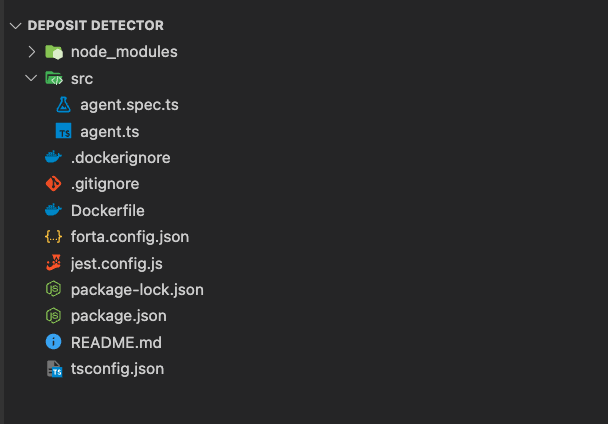
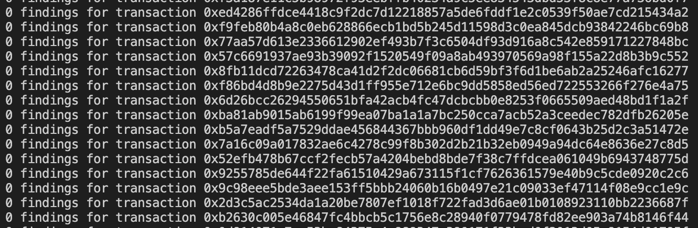

# Forta For Realtime Monitoring And Security Of Your Smart Contract
 One of the essential things in the software industry is monitoring your application.  When running a DeFi protocol, you must detect any potential thread like a giant withdrawal, multiple transactions in a short period from the same wallet, or calling emergency transactions! Forta is an open-source project with bots to keep track of your smart contract activities and alert your inbox if any weird or potential attacks happen.


            

<div style="text-align:center">Just run the bot and wait!</div>

## Prerequisites
- Solidity basics
- Nodejs basics
- [etherjs](https://docs.ethers.io/v5/getting-started/) or [web3js](https://web3js.readthedocs.io/en/v1.8.0/) basics would make things easier

## Agenda
- Develop a smart contract to monitor using the Forta bot
- Build the Forta bot
    - Initiate the bot template
    - How does the bot listen to transactions and blocks
    - Configure your bot to listen to different blockchain protocols
    - Command lines to build and run
- Test on any testnet
  - Configure forta.config.json 
  - Command lines to monitor starting from a specific block/tx hash.
- Test locally

## What Are We Going To Do Exactly?
We have a "Deposit.sol" smart contract. Any account can deposit MATIC on it. The Forta bot will:
- Detect if blacklisted addresses deposit: It will trigger a critical alert.
- Detect If a normal deposit will trigger an info alert.
- If less than 0.01MATIC will trigger a suspicious alert.

### Let's Code The Smart Contract
The "Deposit.sol" smart contract will be a simple payable transaction with one event.
Smart Contract Code
```
pragma solidity =0.8.14;

contract Deposit{ 
     event Deposited(uint256 amount); 
     function deposit() external payable{      
       emit Deposited(msg.value); 
     } 
}
```
This [contract](https://mumbai.polygonscan.com/address/0xA87db9fe057CFF6E296586BeC6a6982A5a9B44b0#writeContract) is already deployed and verified at the Mumbai network. So you can focus only on the bot building!
## Build The Forta Bot
### Initiate The Bot Template
Create a new folder deposit-detector inside it and execute this command
```
mkdir deposit-detector
cd deposit-detector
npx forta-agent@latest init --typescript
```
> ⚠ please use npm package manager for installation not yarn because you will face some issues while deploying the bot.

The above command will install a nodejs project with the following packages:-
- forta-agent:  The most important one is to use the bot.
- forta-agent-tools:  For testing and network management. (I will install it later)
- jest:  For testing.
- nodemon:  For the dev server.
- typescript,@types/jest,@types/nodemo,ts-jest:  To use Typescript

After installation, you should find something like that.



That's a ready template of a working bot. All you need to do is run `npm start` And the bot will start emitting findings in all transfer events on the [Tether](https://etherscan.io/address/0xdac17f958d2ee523a2206206994597c13d831ec7) token deployed on the Ethereum blockchain. How to do this?

## How does the bot listen to transactions and blocks?
To answer this question, go to `src/agent.ts` , or you can check the file content [here](https://github.com/forta-network/forta-bot-sdk/blob/master/starter-project/ts/src/agent.ts#L65). It is the main file of the bot where you can add your bot logic. You will find two exports functions

```
export default {
handleTransaction,
// handleBlock
};
```
**handleTransaction:** Is called each time a new transaction has been submitted. handleTransaction receivesTransactionEvent an object which contains all events that occurred inside a transaction. You can check all TransactionEvent properties from the [documentation](https://docs.forta.network/en/latest/sdk/#transactionevent).

**handleBlock:** Is called each time a new block is minted. handleBlock receives BlockEvent an object which contains all transactions that occurred inside a block. You can check all BlockEvent properties from the [documentation](https://docs.forta.network/en/latest/sdk/#blockevent).

I need the bot to detect deposits inside the "Deposit.sol" smart contract. So I will use only the `handleTransaction`.

## Build The Deposit Detector

Before going to the code, let's think about the steps to build a bot:
1. Blockchain Network: Which blockchain networks do we want to use?
2. Network Manager: Specify the smart contract addresses for different networks we want to monitor.
3. Emit Findings(send notification): Decide which events we want to listen to. 

    In our case, it is only Deposited event:

      - If the Deposited event is called.
      - If the deposited amount is less than 0.01
      - If the deposited address is blacklisted.

## Configure Your Bot To Different Blockchain Networks
In my case, I will add Mumbai Testnet network. And show you how to add multiple ones.


To do this, I will edit two files.


First file `package.json` Replace "1" Ethereum Mainnet chain Id with "80001" Mumbai network chain Id
```
"chainIds": [
   80001
],
```
Second file `forta.config.json` you shouldn't push it on Github for confidential values. It is already included on the `.gitignore`
```
nano forta.config.json
````

Inside the file, put the JSON RPC URL for your Blockchain network
```
{
"jsonRpcUrl": "https://nd-123-456-789.p2pify.com/<Your Chainstack API Key>"
}
```
Now you have your bot listening to the Mumbai network to test run
```
npm start
```
Should give output like this


<div style="text-align:center">If you searched for any tx hash, you should find it on https://mumbai.polygonscan.com</div>
<br/>

As you see above, no findings will be emitted because the contract address is still the wrong one from the Ethereum Mainnet network. Let's add our own smart contract in Network Manager.

## Network Manager: Specify the smart contract addresses for different networks we want to monitor

The network manager has two main purposes. The first one is to map data to its equivalent blockchain network. So if I have a contract address `0xa…` deployed on Ethereum and a contract address `0x0b…` deployed on Polygon. You can get each respective address without changing the code. It maps the addresses and any other equivalent data to  chainId this map name is `networkData`

Create a file for the networkData Map

```
nano src/network.ts
```

Inside `network.ts` add

```
export interface NetworkData {
  address: string; // The smart contract address
  minimumDepositAmount: number; 
  blacklistedAddresses: string[];
}
export const networkData: Record<number, NetworkData> = {
  80001: {
    address: "0xa87db9fe057cff6e296586bec6a6982a5a9b44b0",
    minimumDepositAmount: 0.01,
    blacklistedAddresses: [
      "0x7c71a3d85a8d620eeab9339cce776ddc14a8129c",
      "0x17156c0cf9701b09114cb3619d9f3fd937caa3a8",
    ],
  },
/**
    Bonus: Add Görli network object here, note that for  Ethereum 0.01 ETH maybe a good amount so the minimumDepositAmount should be less than 0.01 ETH
*/
};
```
The second purpose is to use the network manager object to initialize the provider object for the network connection. (If you don't know what a network provider check [this](https://docs.ethers.io/v5/api/providers/#providers)).

To do so, we need to install [forta-agent-tools](https://www.npmjs.com/package/forta-agent-tools)

```
npm i forta-agent-tools
```

Go to `src/agent.ts` 

**Delete all** content inside it and import the `NetworkManager` class from the installed package

```
import { NetworkManager } from "forta-agent-tools";
```

Create the object with the `networkData`. I created on the [network.ts](./code/src/network.ts)

```
// below the import NetworkManager
import { networkData } from "./network";
const networkManager = new NetworkManager(networkData); //global var
```

To add the provider, we need to call `networkManager.init(<provider>)` , but we need this to be called only one time when the bot is **initialized**. Forta has a built-in function to [initialize](https://docs.forta.network/en/latest/sdk/#handlers)

```
import ethers from "forta-agent"
// below the import and the networkManager object
export const provideInitialize = (
  provider: ethers.providers.JsonRpcProvider
) => {
   // should return a function that will be used by the Bot
  return async () => {
    await networkManager.init(provider);
  };
};
```

The last thing export the provider initialize
```
export default {
  initialize: provideInitialize(utils.provider), // The utils object will be added on the next section
};
```
Now in `src/agent.ts` you should have something like this
```
import ethers from "forta-agent";
import { NetworkManager } from "forta-agent-tools";
import { NetworkData, networkData } from "./network";
const networkManager = new NetworkManager(networkData);
export const provideInitialize = (
  provider: ethers.providers.JsonRpcProvider
) => {
   // should return a function that will be used by the Bot
  return async () => {
    await networkManager.init(provider);
  };
};
export default {
  initialize: provideInitialize(utils.provider), // The utils object will be added on the next section
};
```

Inside the bot, we have the network manager and all data that we need. The only missing thing is the `handleTransaction` and the `utils` object. I will start with the utils object. I will create it in a separate file

```
nano src/utils.ts
```
Add the provider

```
import { getEthersProvider } from "forta-agent";
const provider = getEthersProvider();
export default {
  provider
};
```
Because we are already on the utils.ts let's add everything like the finding reports and the event ABI.
The event ABI, We need the event abi to be able to catch it when it triggers

```
// below getEthersProvider import
import { Interface } from "@ethersproject/abi";

const provider = getEthersProvider();

const EVENT_ABI: string[] = ["event Deposited(uint256 amount)"];
const EVENTS_IFACE: Interface = new Interface(EVENT_ABI);
export default {
  provider,
  EVENT_ABI,
  EVENTS_IFACE,
};
```

createFinding function:

 Forta creates finding with types and severity

finding types: Unknown, Exploit, Suspicious, Degraded, Info


finding severity: Unknown, Info, Low, Medium,High, Critical

In our bot, we will use types: Info, Suspicious, and Exploit

for severity: Low, Medium, and Critical

let's create the interface

```
// import section
import {
  Finding,
  FindingSeverity,
  FindingType,
  getEthersProvider,
} from "forta-agent";
// Below EVENTS_IFACE variable
interface FindingParams {
  // deposit, minimum deposit and blacklisted address
  alertId: "001" | "002" | "003"; 
  account: string;
  depositedAmount: string;
  description: string;
  severity: FindingSeverity;
  type: FindingType;
}
```

The `creatFinding` function just an object initializer

```
const createFinding = ({
  alertId,
  account,
  depositedAmount,
  description,
  severity,
  type,
}: FindingParams): Finding => {
  return Finding.fromObject({
    name: "Detects all deposit transactions",
    description,
    alertId: `deposit-${alertId}`,
    severity,
    type,
    protocol: "Depositor",
    metadata: {
      account,
      depositedAmount,
    },
  });


  export default {
      provider,
      EVENT_ABI,
      EVENTS_IFACE,
      createFinding, // add create finding
  };

};
```

The `utils` the file is ready. You can check it [here](./code/src/utils.ts); the last step in building the bot is the implementation of `handleTransaction` function
go to `src/agent.ts`

```
// below provideIntialize function
// should return a function that will be used by the Bot
export const provideHandleTransaction = (): HandleTransaction => async (txEvent: TransactionEvent) => {
 // write code here
}
export default {
 initialize: provideInitialize(utils.provider),
 handleTransaction: provideHandleTransaction(networkManager)
};
```
after each tx emitted on the blockchain Forta bot return an array of findings

```
async (txEvent: TransactionEvent) => {
    const findings: Finding[] = [];
}
```

Use filter log to get all `Deposited` event trigger on your smart contract

```
// below the finding array
const depositLogs = txEvent.filterLog(
      utils.EVENT_ABI,
      networkManager.get("address") 
    );
```

The `networkManager.get("address")` will return the smart contract address placed [here](./code/src/network.ts#L9).

The last step is to start emitting the finding.

```
depositLogs.forEach((log: LogDescription) => {
      const amount = ethers.utils.formatEther(log.args.amount);
      // Emit finding for new deposit
      findings.push(
        utils.createFinding({
          alertId: "001",
          account: txEvent.transaction.from,
          depositedAmount: amount,
          description: "New deposit!",
          severity: FindingSeverity.Low,
          type: FindingType.Info,
        })
      );
      // Emit finding if deposit less than the minimum amount
      if (Number(amount) < networkManager.get("minimumDepositAmount")) {
        findings.push(
          utils.createFinding({
            alertId: "002",
            account: txEvent.transaction.from,
            depositedAmount: amount,
            description: "Someone deposited a very small amount",
            severity: FindingSeverity.Medium,
            type: FindingType.Suspicious,
          })
        );
      }
      // Emit finding for blacklisted addresses
      if (
        networkManager
          .get("blacklistedAddresses")
          .includes(txEvent.transaction.from)
      ) {
        findings.push(
          utils.createFinding({
            alertId: "003",
            account: txEvent.transaction.from,
            depositedAmount: amount,
            description: "Blacklisted addresses deposit!",
            severity: FindingSeverity.Critical,
            type: FindingType.Exploit,
          })
        );
      }
    });
return findings;
```

And that's it. Now your [bot](./code/src/agent.ts) is ready to use, just run
```
npm start
```
Go to the smart contract and [deposit](https://mumbai.polygonscan.com/address/0xA87db9fe057CFF6E296586BeC6a6982A5a9B44b0#writeContract). Get [faucet token](https://faucet.polygon.technology/) if you don't have one.

Or you can test by asking your bot to listen to a specific transaction using this command.

```
npm run tx <transaction hash>
```

Or to listen to all transactions that happened on a block

```
npm run block <block number>
```

You can get the values of the transaction hash or the block number from the [readme](./code/README.md#test-data) file. And that's it for the bot development. Now your bot is ready to use! 

But in most cases, bots may be more complicated than this, so I recommend you always create a unit test with positive and negative scenarios for your bot.


## Testing Your Bot
Create testing file

```
nano src/agent.sepc.ts
```
All variables need to be imported
```
import {
  Finding,
  HandleTransaction,
  ethers,
  FindingSeverity,
  FindingType,
} from "forta-agent";
import { createAddress, NetworkManager } from "forta-agent-tools/lib/utils";
import { TestTransactionEvent } from "forta-agent-tools/lib/test";
import { provideHandleTransaction } from "./agent";
import utils from "./utils";
import { networkData } from "./network";
```

Create some constant for wrong values  in case of negative scenarios

```
// Below the imports
const WRONG_EVENT_ABI: string[] = [
  "event Transfer(address indexed from,address indexed to,uint256 value)",
];
const WRONG_EVENT: ethers.utils.EventFragment = new ethers.utils.Interface(
  WRONG_EVENT_ABI
).getEvent("Transfer");
// wrong contract address
const WRONG_ADDRESS = createAddress("0x0d");
```

Create some findings in case of positive scenarios

```
const expectedFindings = [
  utils.createFinding({
    alertId: "001",
    account: "0x7c71a3d85a8d620eeab9339cce776ddc14a8129c",
    depositedAmount: "0.001",
    description: "New deposit!",
    severity: FindingSeverity.Low,
    type: FindingType.Info,
  }),
  utils.createFinding({
    alertId: "002",
    account: "0x7c71a3d85a8d620eeab9339cce776ddc14a8129c",
    depositedAmount: "0.001",
    description: "Someone deposited a very small amount",
    severity: FindingSeverity.Medium,
    type: FindingType.Suspicious,
  }),
  utils.createFinding({
    alertId: "003",
    account: "0x7c71a3d85a8d620eeab9339cce776ddc14a8129c",
    depositedAmount: "0.001",
    description: "Blacklisted addresses deposit!",
    severity: FindingSeverity.Critical,
    type: FindingType.Exploit,
  }),
];
```

Create test suites then initialize handle tx and the network manager 

```
// Below expectedFindings arrays
describe("Deposits monitor test suite", () => {
  let handleTx: HandleTransaction;
  const networkManager = new NetworkManager(networkData);
beforeAll(async () => {
    await networkManager.init(utils.provider);
    handleTx = provideHandleTransaction(networkManager);
  });
// Test Cases Will be here
}
```
**The best way** to test a bot is by mocking fake events and sending them to the bot to check if they will be matched or not
To do so, we use `TestTransaction` event object imported from forta-agents-tools

```
new TestTransactionEvent().addEventLog(<Event Abi>,[<event parameters>]
```

This will generate a mock `txEvent` you can read more about `TestTransactionEvent` [here](https://github.com/NethermindEth/general-agents-module#testtransactionevent). I am going to use it for all test cases

First test case if it is a transaction from a different event

```
it("should return no funding if its a different event", async () => {
    const txEvent = new TestTransactionEvent()
      .addEventLog(WRONG_EVENT, WRONG_ADDRESS, [
        createAddress("0x01"),
        createAddress("0x02"),
        ethers.utils.parseEther("0.001"),
      ])
      .setFrom(networkManager.get("blacklistedAddresses")[0]);
    const findings: Finding[] = await handleTx(txEvent);
    
    expect(findings).toStrictEqual([]);
  });
```
Second test case if it a wrong smart contract address but correct event

```
it("should return no funding if its a different contract", async () => {
    const event = utils.EVENTS_IFACE.getEvent("Deposited");
const txEvent = new TestTransactionEvent()
      .addEventLog(event, WRONG_ADDRESS, [ethers.utils.parseEther("0.001")])
      .setFrom(networkManager.get("blacklistedAddresses")[0]);
    const findings: Finding[] = await handleTx(txEvent);
    
    expect(findings).toStrictEqual([]);
  });
```

The third test case should emit the three findings
```
it("should return three funding on the same transaction", async () => {
    const event = utils.EVENTS_IFACE.getEvent("Deposited");
const txEvent = new TestTransactionEvent()
      .addEventLog(event, networkManager.get("address"), [
        ethers.utils.parseEther("0.001"),
      ])
      .setFrom(networkManager.get("blacklistedAddresses")[0]);
    const findings: Finding[] = await handleTx(txEvent);
    expect(findings).toStrictEqual(expectedFindings);
  });
});
```

And that's it! Thank you.

## Useful Links

- [A lot of professional bots for different DeFi protocols](https://github.com/NethermindEth/Forta-Agents/tree/main)
- [The documentation](https://docs.forta.network/en/latest/quickstart/)
- [Forta General Agent](https://www.npmjs.com/package/forta-agent-tools)
- [Subscribe to the Forta Bounty program](https://immunefi.com/bounty/forta/)
- [Contribute to the Forta project](https://www.npmjs.com/package/forta-agent-tools)