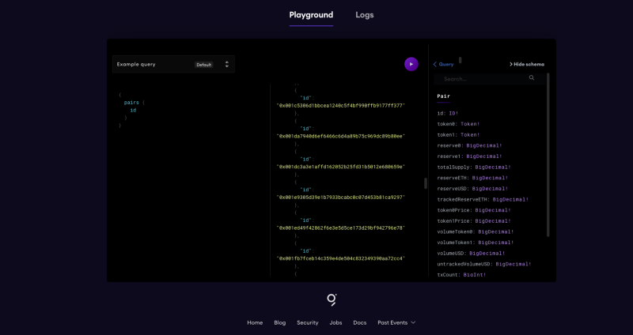
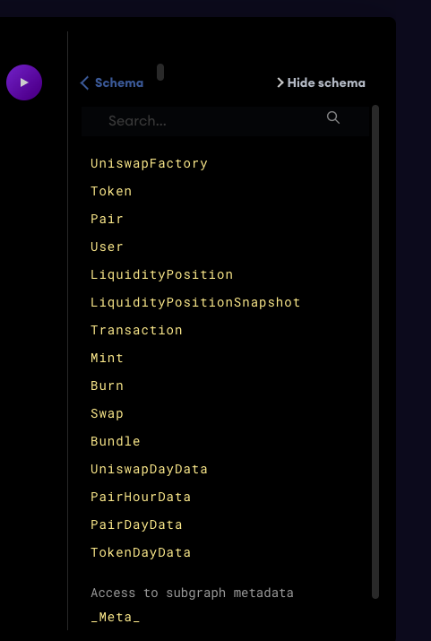
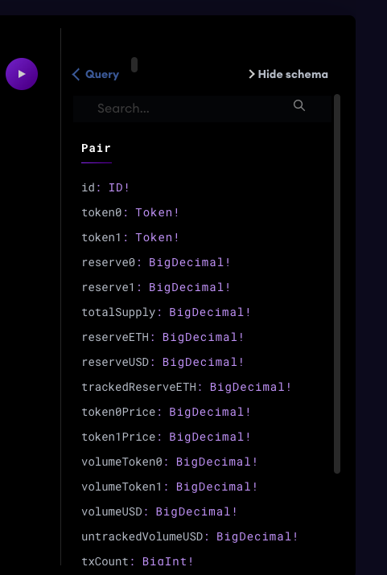
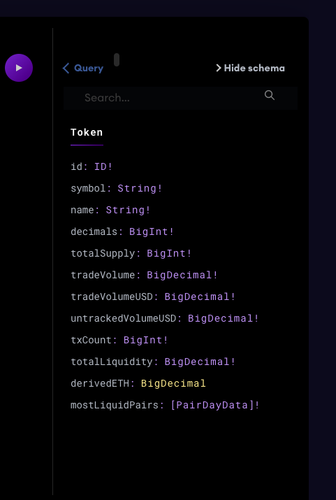
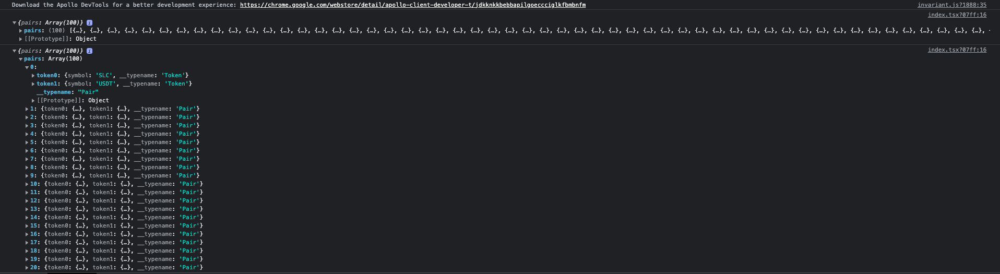
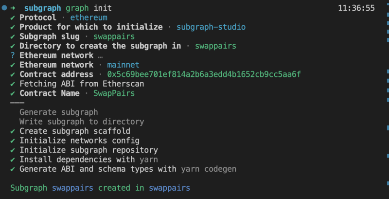
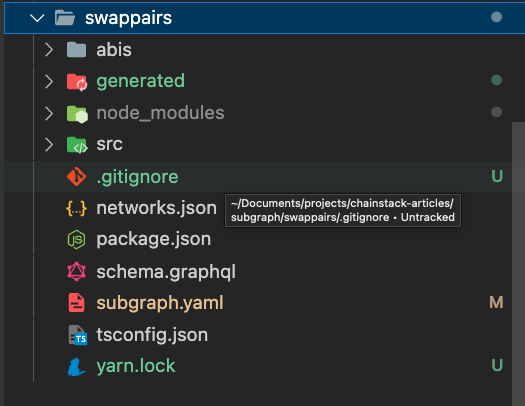
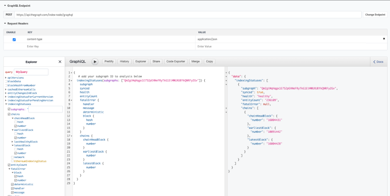

# The Graph Protocol For Querying Smart Contracts Data

[The graph protocol](https://thegraph.com/en/) is [GraphQL](https://graphql.org/) but the decentralized version. In this article, we will explain everything about the graph.
Imagine you have a smart contract with an array of ERC20 token addresses. You want to get all available tokens' names. How to do it?

Without the graph protocol

```
const tokenNames =
        await Promise.all(tokensAddresses
                     .map(async(tokenAddress)=>{
                           const contract =
                             new Contract(tokenAddress,ABI);
                           return await contract.name();
                      }))
```

Suppose the `tokenAddresses` array length is ten. You have to do ten calls to the blockchain!! Of course number of addresses increase, ⬆ ️mean the number of calls increases ⬆, Which makes your frontend app slow.

How to handle this? How DeFi protocols like Uniswap handle this?
The answer is The graph protocol!

Same code with the graph

```
const tokenNames = await appoloClient.query(getAllTokenNamesQueries)
```

And that's it; you get all queries with only one call! The graph makes your code much more optimal and less complicated.

## Prerequisites

- Nodejs basics and package manager (npm/yarn) [basics](https://nodejs.dev/en/learn/introduction-to-nodejs/)
- [Promise](https://developer.mozilla.org/en-US/docs/Learn/JavaScript/Asynchronous/Promises) basics.
- [Async functions](https://developer.mozilla.org/en-US/docs/Web/JavaScript/Reference/Statements/async_function).
- Frontend basics would be nice to have. [React tutorial](https://reactjs.org/tutorial/tutorial.html)

## Agenda

- Demonstrate Uniswap subgraph on subgraph studio.
- Learn how to query data.
- Connect the subgraph to your web app.
- Build your subgraph to catch all pairs of token names initialized for swap.
- Deploy your subgraph.
- Debug and test your subgraph.

## Demonstrate Uniswap Subgraph On The Graph Studio

Uniswap subgraph is deployed on [the graph studio](https://thegraph.com/hosted-service/subgraph/uniswap/uniswap-v2)

<figure>
  
  <figcaption align="center">The Graph Studio Playground</figcaption>
</figure>

The first thing on the left is the default query. The default query returns all created `Pair` smart contract addresses.

```
{
  pairs {
    id
  }
}
```

Press the run button. Then we have the output.

```
"data": {
    "pairs": [
      {
        "id": "0x00004ee988665cdda9a1080d5792cecd16dc1220"
      },
      {
        "id": "0x0000871c95bb027c90089f4926fd1ba82cdd9a8b"
      },
....
```

The above output is the same as receiving HTTP calls from your web app. 
The object will look like

```
data->pairs->[id]
which is
data->schema name -> array of properties
```

Now you have everything you need to get any data you want from Uniswap.

### Learn How To Query Data

Assume you want to get all available pairs of tokens by the symbol.

Example: ETH-USDC, APE-USDT…etc

<figure>
  
  <figcaption>All schema names and properties are listed on the left</figcaption>
</figure>
To fetch the available pairs, we need to select the Pair schema. The third one on the above image 👆)
<figure>
  
  <figcaption>Pair schema properties</figcaption>
</figure>

We fetch symbols of tokens pair, so we care only about `token0` and `token1`. Their type `Token!` and the `!` mark at the end means this property is required. We know [BigDecimal](https://thegraph.com/docs/en/developing/assemblyscript-api/#big-decimal) type and ID type, but what is the Token type? A token is a customized type. Let's check this to understand.

<figure>
  
  <figcaption>The Token schema</figcaption>
</figure>

It is another schema, and schemas are linked to each other by including Its name as a type inside another schema like this.

```
type Pair{
   token0: Token! # Token is also a schema
}
```

Return to what we need; We want to query all available symbol pairs. So we select the Pair schema.

```
pairs{

}
```

Inside the pair schema select `token0` and `token1` properties

```
pairs{
   token0{}
   token1{}
}
```

Select the `symbol` property from the tokens

```
{
  pairs{
    token0{
      symbol
    }
    token1{
      symbol
    }
  }
}
```

Put this query on the subgraph studio, and the result should be something like this.

```
{
  "data": {
    "pairs": [
      {
        "token0": {
          "symbol": "SLC"
        },
        "token1": {
          "symbol": "USDT"
        }
      },
      {
        "token0": {
          "symbol": "HORE"
        },
        "token1": {
          "symbol": "WETH"
        }
      },
    ....
```

And that's it. We can play around with different queries
Like the search for all pairs with a total supply greater than 10K

```
{
  pairs(where:{totalSupply_gt:10000}) {
    id
    totalSupply
  }
}
```

You can read more about queries [here](https://thegraph.com/docs/en/querying/querying-the-graph/). Now lets, connect all of this data to a frontend application.

## Connect The Subgraph To Your Web App

Feel free to use any frontend framework you prefer. For me. I will use [Next.js](https://nextjs.org/)

```
yarn create next-app --typescript
```

After Initializing your project, install the [Apollo client](https://www.apollographql.com/docs/react/#:~:text=Apollo%20Client%20is%20a%20comprehensive,while%20automatically%20updating%20your%20UI.)

```
cd next-app
yarn add @apollo/client
```

It is the most famous client for GraphQl. You can generally read more about it [here](https://www.apollographql.com/docs/react/data/queries/).
We will use the same query and assign it to a constant variable. Create this new directory for all constant values `constants/` and inside `constants/` add queries file `constants/queries.qgl.ts`

```
import { gql } from "@apollo/client";
const pairSymbolsQuery = gql`
  {
    pairs {
      token0 {
        symbol
      }
      token1 {
        symbol
      }
    }
  }
`;
```

Initialize the client globally,create `apolloClient.ts` inside frameworks directory `frameworks/apolloClient.ts`

```
import { ApolloClient, DefaultOptions, InMemoryCache } from "@apollo/client";
// For a simple example, we don't need cache
const defaultOptions: DefaultOptions = {
  watchQuery: {
    fetchPolicy: "no-cache",
    errorPolicy: "ignore",
  },
  query: {
    fetchPolicy: "no-cache",
    errorPolicy: "all",
  },
};
const uriQuery = "https://api.thegraph.com/subgraphs/name/uniswap/uniswap-v2"; // the api url from the graph studio
export const apolloClient = new ApolloClient({
  uri: uriQuery,
  cache: new InMemoryCache(),
  defaultOptions,
});
```

You can find the two files here:

[constants/queries.qgl.ts](./code/frontend/constants/queries.qgl.ts)

[frameworks/apolloClient.ts](./code/frontend/frameworks/apolloClient.ts)

Then go to the [pages/index.tsx](./code/frontend/pages/index.tsx) and wrap your application with ApolloProvider and the initialized client

```
<ApolloProvider client={apolloClient}>
     <!-- Your App -->
</ApolloProvider>
```

And that's it you are ready to fetch data from the subgraph.
Fetch pairs of symbols from `pages/index.ts`

Import client and query

```
// Other imports..
// import the client used to do the query
import apolloClient from "frameworks/apolloClient.ts"
// import the query itself
import pairSymbolsQuery from "constants/queries.qgl.ts"
```

Do the API call inside a `useEffect` hook.

```
// .... Some Code .....
// Inside component
useEffect(()=>{
    const fetchQuery = async()=>{
       const result = await apolloClient.query({
          query: pairSymbolsQuery
       })
       console.log(result.data)
     }
  fetchQuery()
},[])
```

Now run your project `yarn dev` and check the console. You should see the same query result from graph studio.

<figure>
  
  <figcaption align="center">Your project console</figcaption>
</figure>

Apollo clients have multiple hooks to [query](https://www.apollographql.com/docs/react/data/queries), [fetch](https://www.apollographql.com/docs/react/data/queries), and [cache](https://www.apollographql.com/docs/react/data/queries). Feel free to play around with them.
Apollo clients also support variables inside queries, for example.

```
await apolloClient.query({
          query: pairSymbolsQuery
          variables: { totalSupply: "1000"},
       })

```

To identify a variable inside a query, you need only to start it with `$` like the `$totalSupply` variable.

```
   query getTotalSupplyGt($totalSupply: BigDecimal) {
    pairs(where:{totalSupply_gt: $totalSupply}) {
        id
        totalSupply
    }
   }
```

You can connect your frontend with any subgraph on the graph studio. Just copy the API URL. In the next section, we will create our subgraph to get the token names of every initialized pair to swap.

## Build Your Subgraph To Catch All Pairs Of Token Names Initialized For Swap

Before starting implementing, The subgraph is defined by mainly three components.

- Schema
- mapper
- YAML file

### Schema

`schema.graphql` The schema file should define the data you want to fetch. For example, if you're fetching token data, the token entity should look like this.

```
type Token @entity {
  id: ID! # token address
  name: String!
  symbol: string!
  decimals: BigInt!
   ...
}
```

### Mapper

Inside `src/` or `mapping/` you add the handler function. Handler functions trigger once an event has been called, for example.

```
// PairCreated is an event inside the smart contract
export function handlePairCreated(event: PairCreated): void {
    // What will happen after the event is triggered
}
```

### YAML file

`subgraph.yaml` map handlers to the event. For example, to make the above handler work, we will link it with the event inside subgraph.yml this way.

```
eventHandlers:
        - event: PairCreated(indexed address,indexed address,address,uint256)
          handler: handlePairCreated
  file: ./<mapper file location>/map.ts
```

Now you understand the three primary files to create a subgraph; you can start by installing the graph-cli

```
yarn global add @graphprotocol/graph-cli
```

Create a directory and initialize the project

```
# Inside the project directory
graph init
```

This command will ask you some questions

1. Protocol? Ethereum
2. Product for which to initialize? Subgraph-studio hosted service may be better if you want to control who queries your graph and the cost
3. Subgraph slug? I will name it swappairs
4. Ethereum Network? mainnet
5. Contract Address? 0x5c69bee701ef814a2b6a3edd4b1652cb9cc5aa6f
6. Contract Name? Pairs
   Then the project will start installing, and you should see something like this 👇

<figure>
  
</figure>

After installing, you should now access the project from your code editor.

<figure>
  
</figure>

Start with the entities inside `schema.graphql` and put the data you need to
The first schema is the `Token`. It will be simple. We need only the contract address and the token name

```
type Token @entity {
  id: ID! # contract address
  name: String!
}
```

The second schema is the `CreatedPairs`. Its the two pairs of tokens details, the transaction hash and the timestamp.

```
type CreatedPair @entity {
  id: ID! # transaction hash
  token0: Token!
  token1: Token!
  timestamp: BigInt!
}
```

The schema file is ready. You can check it on [src/schema.graphql](code/subgraph/schema.graphql). The last thing is to generate the schema entities by running

```
yarn codegen
```

The command I will explain it in detail later.

Let's do the logic now.
Go to [src/swap-pairs.ts](code/subgraph/schema.graphql) delete everything inside the file

Import the schema file

```
// Import the created swap entity
import { PairCreated } from "../generated/SwapPairs/SwapPairs";
```

Create the first handler

```
// PairCreated is an event inside the smart contract
export function handlePairCreated(event: PairCreated): void {
    // What will happen after the event is triggered
}
```

Inside the `handlePairCreated` function, let's initialize the entity for `CreatedPair`

```
  // Inside handlePairCreated
  let createdPair = new CreatedPair(event.transaction.hash.toHexString());
```

The entity takes the schema ID as parameter `new CreatedPair(<transaction hash>)`.

Assign values to the schema properties

```
createdPair.timestamp = event.block.timestamp;
```

We need to get the two pairs of tokens' names. Unfortunately, the event includes the address of the tokens only, not their names. So we need to read from the smart contract the token name.
To do this first, let's import ERC20 smart contract ABIs

go to [abis/](./code/subgraph//abis/) and add [Erc20.json](./code/subgraph/abis/Erc20.json) abi file, then write on your terminal/cmd

```
# inside the project directory
yarn codegen
```

That's all now. All initialize the ERC20 smart contract object.

```
  // In src/swap-pairs.ts inside hanldePaireCreated
  // After assigning the timestamp
  const tokenOContract = Erc20.bind(event.params.token0);
  const token1Contract = Erc20.bind(event.params.token1);
```

A good practice when calling any external call is using `try_<query>` to avoid throwing errors. Something like this

```
// After initializing the contract object,
if (tokenOContract.try_name().reverted) {
    log.error("token0 name not found {}", [
      event.transaction.hash.toHexString()
    ]);
    return;
  }
  if (token1Contract.try_name().reverted) {
    log.error("token1 name not found {}", [
      event.transaction.hash.toHexString()
    ]);
    return;
  }
```

If reading the contract name revert or gives any failure message, you can stop saving this token or add it with the default value "Unkown". In our case, I will only log the message with the error and the transaction hash to debug what may happen. The logger is from [@graphprotocol/graph-ts](https://www.npmjs.com/package/@graphprotocol/graph-ts). Feel free to check their documentation
The next step is to load the token schema if it exists or create a new one.

```
  let token0 = Token.load(event.params.token0.toHexString());
  let token1 = Token.load(event.params.token1.toHexString());
```

The `<SchemaName>.load` return the entity object or null if it doesn't exist. So we need to check

```
if (!token0) {
  // Create token entity here
  }
  if (!token1) {
   // Create token entity here
  }
```

For simplicity's sake, the token entity has only the token name as the property, and the token address is the ID

```
  if (!token0) {
    token0 = new Token(event.params.token0.toHexString());
    let token0Name = tokenOContract.name();
    if (isString(token0Name)) {
      token0.name = tokenOContract.name();
    }
    token0.name = tokenOContract.name();
    token0.save();
  }
  if (!token1) {
    token1 = new Token(event.params.token1.toHexString());
    token1.name = token1Contract.name();
    token1.save();
  }
```

Now you have created two token entities or imported them if The token already exists from another pair. To link entities with each other, you need to add a link by Id, like this

```
  createdPair.token0 = event.params.token0.toHexString();
  createdPair.token1 = event.params.token1.toHexString();
  //Don't forget to save the createdPair entity
  createdPair.save();
```

And that's it. You can check the file [here](./code/subgraph/src/swap-pairs.ts)

## Deploy Your Subgraph

go to [package.json](./code/subgraph/package.json) file and check the available scripts

```
"scripts": {
    "codegen": "graph codegen",
    "build": "graph build",
    "deploy": "graph deploy --node https://api.studio.thegraph.com/deploy/ swappairs",
    "create-local": "graph create --node http://localhost:8020/ swappairs",
    "remove-local": "graph remove --node http://localhost:8020/ swappairs",
    "deploy-local": "graph deploy --node http://localhost:8020/ --ipfs http://localhost:5001 swappairs",
  },
```

[codgen](https://thegraph.com/docs/en/cookbook/cosmos/#creating-and-building-a-cosmos-subgraph): Generate all types inside the entity to initialize and do the mapping inside the handler.

build: after executing codgen the command, the subgraph will build to check if you have any errors before the deployment

The remaining three commands are for local deployments. To query blockchain running on your localhost like ganache. In this tutorial, I will focus on the graph studio and blockchain on the mainnet. If you are interested in building a subgraph for your localhost blockchain, I recommend [this tutorial](https://thegraph.academy/developers/local-development/) from the [graph academy](https://thegraph.academy/).

To connect your subgraph with the subgraph studio, use this command. You need to run it only once to authenticate your graph.

```
  graph auth --studio <Deploy-key-You-will-find-it-as-access-Token>
```

To deploy

```
  graph deploy --product hosted-service <your-username/project-name>
```

In our case, I will add this command to the script object.

```
# After remove-local command
"deploy-hosted-service": "graph deploy --product hosted-service yehia67/swappairs"
```

Now run

```
yarn deploy-hosted-service
```

And you should find your subgraph deployed on the graph studio. You can check it out [here](https://thegraph.com/hosted-service/subgraph/yehia67/swappairs).

## Debug And Test Your Subgraph

We have a simple example in this tutorial, so we didn't need much testing, but you can use fork debugging mode [here](https://thegraph.com/docs/en/cookbook/subgraph-debug-forking/).

And create [unit test cases](https://thegraph.com/docs/en/cookbook/subgraph-debug-forking/) for your subgraph. I didn't see a lot of protocols using test cases for their graphs, but It is a good practice for sure!

One last thing, In case you want to debug a deployed subgraph. Why it's failing? Or you want to analyze it. You can use [Hasura graphQL](https://cloud.hasura.io/public/graphiql?endpoint=https%3A%2F%2Fapi.thegraph.com%2Findex-node%2Fgraphql) API to check.
Use this query to analyze your deployed graph.

```
{
  indexingStatuses(subgraphs: ["Qm..."]) {
    subgraph
    synced
    health
    entityCount
    fatalError {
      handler
      message
      deterministic
      block {
        hash
        number
      }
    }
    chains {
      chainHeadBlock {
        number
      }
      earliestBlock {
        number
      }
      latestBlock {
        number
      }
    }
  }
}

```

Call Type: POST

URL: https://api.thegraph.com/index-node/graphql

You should have something like this.

<figure>
  
</figure>

That's all. Thank you!

## References

[Subgraph academy](https://thegraph.academy/course/subgraph-developer-course/)

[Subgraph protocol](https://thegraph.com/docs/en/developing/assemblyscript-api/)

[Subgraph development](https://medium.com/protofire-blog/subgraph-development-part-1-understanding-and-aggregating-data-ef0c9a61063d)
